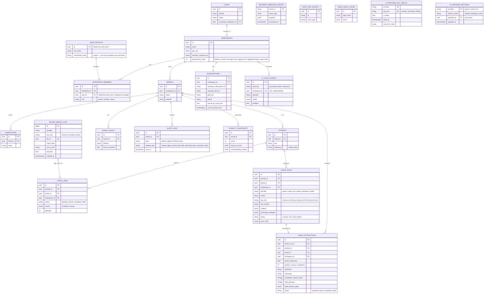

# Entity-Relationship Diagram

Postgres schema (Supabase) for the MVP. Scoped to exactly what modules 5.1-5.12 need — nothing added speculatively for Phase-2 engines (6.0) beyond the `provider` column already being a free-text field, which is what makes it extensible without a migration.

## Diagram

## Full column reference

Columns omitted from the diagram above for readability (every table also has `created_at timestamptz default now()` unless noted):

| Table                    | Additional columns                                                                                                                                                                                         |
| ------------------------ | ---------------------------------------------------------------------------------------------------------------------------------------------------------------------------------------------------------- |
| `workspaces`             | `created_at`                                                                                                                                                                                               |
| `workspace_members`      | `created_at`                                                                                                                                                                                               |
| `user_profiles`          | `created_at`                                                                                                                                                                                               |
| `brands`                 | `updated_at`, `created_at`                                                                                                                                                                                 |
| `competitors`            | `website text`                                                                                                                                                                                             |
| `prompts`                | `active bool default true`, `created_at`                                                                                                                                                                   |
| `check_jobs`             | `available_at timestamptz`, `locked_at timestamptz`, `completed_at timestamptz`, `last_error_code text`, `created_at`                                                                                      |
| `check_runs`             | `checked_at timestamptz`, `created_at`                                                                                                                                                                     |
| `check_extractions`      | `provider text`, `model text`, `extracted_at timestamptz`, `claimed_at timestamptz`, `attempts int`, `last_error_code text`, `created_at`                                                                  |
| `visibility_snapshots`   | `workspace_id uuid FK → workspaces` (denormalized, single-equality RLS), `mention_count int`, `avg_rank numeric`, `share_of_voice jsonb`, `source_influence jsonb`, `explanation_breakdown jsonb`, `opportunity_gaps jsonb`, `recommended_actions jsonb`, `explanation_skip_reason text` ('free_plan' \| 'no_competitor_ahead'), `status text` (not_applicable/queued/processing/retry/completed/failed — tracks only the async explanation sub-step, not the row as a whole), `attempts int`, `claimed_at timestamptz`, `last_error_code text`, `explanation_provider text`, `explanation_model text`, `explanation_completed_at timestamptz`, `period_start date`, `period_end date`, `generated_at timestamptz`                                       |
| `crawl_audits`           | `robots_txt_result jsonb`, `schema_present bool`, `heading_structure jsonb`, `checked_at timestamptz`                                                                                                                                 |
| `alert_logs`             | `payload jsonb`, `recipient_count int`, unique on `(brand_id, type, dedupe_key)` — the idempotency/dedupe guard (Module 5.8)                                                                              |
| `subscriptions`          | `updated_at timestamptz`                                                                                                                                                                                   |
| `razorpay_webhook_events`| (no additional — `event_id` is the PK, `processed_at` defaults to `now()`)                                                                                                                                |
| `rate_limit_events`      | `created_at`                                                                                                                                                                                               |
| `free_check_cache`       | `brand_name_input text`, `prompt_input text`, `created_at` (TTL enforced in application logic — see caching note below)                                                                                    |
| `leads`                  | `company_name text`, `contact_email text`, `free_check_result jsonb`, `email_sent_at timestamptz`                                                                                                          |
| `ai_task_configs`        | `updated_by uuid FK → auth.users`, `updated_at timestamptz`, `created_at`                                                                                                                                  |
| `ai_provider_key_health` | `updated_at timestamptz`                                                                                                                                                                                   |
| `ai_provider_settings`   | `updated_at timestamptz`                                                                                                                                                                                   |
| `engine_error_logs`      | `created_at timestamptz`                                                                                                                                                                                   |

## Design decisions (read before modifying this schema)

**Why `check_runs` IS split into a raw-answer table (`check_runs`) and a separate extracted-fields table (`check_extractions`).** Module 5.3 writes `check_runs` (the raw Gemini/NIM answer, citations, grounding metadata, provider/model/key_slot). Module 5.4 then claims queued `check_extractions` rows and fills in `brand_mentioned`, `position_among_competitors`, `sentiment`, `reasoning`, `competitor_names_found`, `cited_domains`, and `cited_domain_types` via an NLP extraction call. This split exists because the extraction step is asynchronous (queue-based, with its own `status`/`claimed_at`/`attempts` retry machinery) and runs through a different AI provider (NVIDIA NIM) than the grounded search (Gemini). A `check_extractions` row is created at the same time as its parent `check_run`, starts in `pending` status, and is claimed by the extraction worker independently.

**Why `check_jobs` exists as a separate queue table from `check_runs`.** `check_jobs` is the scheduling/dispatch queue: it tracks which (prompt, brand) pairs are due for a check, how many attempts have been made, and whether a job is locked by a worker. `check_runs` is the result: one row per completed (or errored) execution, with the raw AI answer. A single `check_job` produces exactly one `check_run` on success. The separation keeps the queue machinery (locking, stale-job reclamation, retry counting) off the results table, which is read-heavy from the dashboard.

**Why `check_runs` records `key_slot` (added in Module 5.10).** To surface per-key quota consumption (primary/secondary/tertiary) in the Admin Console (5.10), worker calls capture which key slot executed each request via an `onAttempt` callback in `withKeyFailover` and record `p_key_slot` in `complete_check_job` and `retry_or_fail_check_job`. Historical rows prior to migration 0019 are nullable and display as an "unknown" slot bucket.

**Why `check_extractions.competitor_names_found` is `text[]`, not `jsonb`.** The migration (0013) defines this as a Postgres `text[]` array, matching `cited_domains` (also `text[]`). `cited_domain_types` is `jsonb` because it's a structured object (domain → type mapping), not a flat list. An earlier version of this ERD incorrectly documented `competitor_names_found` as `jsonb` — the migration is the ground truth.

**Why `ai_provider_key_health`, `ai_provider_settings`, and `engine_error_logs` have service-role-only access.** Built in Module 5.3 and surfaced in Module 5.10, these tables track API key health, global failover mode settings (`shared` vs `emergency-only`), and detailed execution error logs. They have RLS enabled with zero policies (deny-all to PostgREST) and are accessed exclusively via server-side code using the Supabase service-role client.

**Why `visibility_snapshots` holds both the score/share-of-voice data and the Explanation Engine output.** Same reasoning: one snapshot per brand per period, computed together, always displayed together on the Competitor Explorer view (module 5.6).

**Why `visibility_snapshots` has a separate `source_influence` column from `share_of_voice` and `explanation_breakdown` (added in Module 5.5).** `source_influence` (citation domains by type across the whole brand) is its own acceptance criterion, distinct from `share_of_voice` (brand vs. named-competitor mention counts) and `explanation_breakdown` (the competitor-comparison-specific breakdown used only by the paid Explanation Engine) — folding it into either would conflate two different axes of data, so it gets its own column. Score, `mention_count`, `avg_rank`, `share_of_voice`, and `source_influence` are computed synchronously by pure SQL (`run_visibility_scoring_cycle()`) at row-insert time and are never deferred to a queue, since they have zero external dependency; only the Explanation Engine's prose (`explanation_breakdown.explanation_text` and `recommended_actions`) genuinely needs the async `status`/`claimed_at`/`attempts`/`last_error_code` queue-and-retry machinery, because it's the one sub-step that calls an external, rate-limited API — so a row with `status = 'not_applicable'` is already complete and final, not "pending."

**Why `free_check_cache` and `leads` aren't linked to `brands`/`workspaces` by a required foreign key.** Both are populated by anonymous, pre-customer activity — there is no workspace yet when a visitor runs the free tool or when a lead is sourced by the growth pipeline. `leads.converted_workspace_id` is a nullable FK, set only if and when that lead becomes a paying customer, so the growth pipeline's effectiveness stays traceable without forcing every anonymous row into the tenant model.

**Why `user_profiles` exists separate from `auth.users`.** Supabase's `auth.users` table is managed by GoTrue and can't have custom columns or RLS policies. `user_profiles` (created by a trigger on `auth.users` insert) stores the `raw_email` and `normalized_email` needed for the one-free-workspace-per-real-inbox uniqueness check (Module 5.1). It's the only table that references `auth.users` directly.

**Why `razorpay_webhook_events` exists.** Razorpay delivers webhooks with at-least-once semantics. This table is an idempotency guard: the `event_id` (synthesized as `event_type:subscription_id:created_at`) is the PK, so a duplicate delivery is rejected by the unique constraint before any subscription state is updated. Written only by the webhook route via the `record_webhook_event` RPC (service-role only).

**Why `rate_limit_events` has RLS enabled with no policies.** It's an append-only log written by server-side rate-limiting middleware (service-role client) and read only by the same middleware. No customer ever needs to see or write to it. The zero-policy pattern (RLS on, no SELECT/INSERT/UPDATE/DELETE grants) means PostgREST rejects any direct API access.

**`ai_task_configs` is the one table with no customer-facing RLS at all.** Every other table's RLS grants access to the owning workspace's members; this one grants access to nobody except server-side Admin Console routes running under the Supabase service role. A `unique` index on `(task_key) WHERE workspace_id IS NULL` guarantees exactly one global default per task, and `unique (task_key, workspace_id) WHERE workspace_id IS NOT NULL` guarantees at most one override per task per workspace. See `docs/CONVENTIONS.md` Section 5 for the full resolution logic (workspace override → global default → `enabled` check) and why this lives in the DB instead of code.

**Row Level Security.** Every table below `brands` (competitors, prompts, crawl_audits, alert_logs, visibility_snapshots) is scoped by joining up to `brands.workspace_id`, matching `docs/CONVENTIONS.md` Section 5. `check_runs` and `check_extractions` each carry a denormalized `workspace_id` column (set at insert time from the parent prompt's brand), so their RLS policy is a single equality check rather than a multi-level join on the highest-volume tables. `free_check_cache` and `leads` have no RLS — they hold no tenant data.

**Caching.** `free_check_cache` implements the 24-hour public free-check cache from `docs/CONVENTIONS.md` Section 4 — enforced by checking `created_at > now() - interval '24 hours'` in application code before a cache hit is used, not by a database TTL feature (Supabase's free tier has none). A `unique index` on `input_hash` prevents duplicate concurrent writes for the same (brand, prompt) pair.

**Why `experiments_used` is a plain counter on `workspaces`, not a separate table.** The Free plan's 3-check allowance is a one-time lifetime cap with no period to reset against, so it lives as a single column on the workspace itself. The cap (3) is enforced in application logic (5.3, 5.9), not a second DB column — it's a fixed product rule, not a per-workspace variable.

**What's deliberately not here.** No `notifications` table (5.8 sends email directly and logs to `alert_logs`, it doesn't need a queue at this scale). No per-engine tables for the Phase-2 providers (6.0) — `check_runs.provider` is already a free-text column, so adding OpenAI/Perplexity/Copilot is a data change, not a schema change. No soft-delete columns anywhere yet — add them when there's an actual customer-deletion flow to support, not before. No `usage_counters` table — prompt-count enforcement is handled by a DB trigger on `prompts` (migration 0005), brand-count enforcement by a trigger on `brands` (migration 0023), and check-frequency enforcement by the `check_jobs` scheduling logic (migration 0007); a separate counter table was planned in the original ERD but turned out to be unnecessary once trigger-based enforcement was implemented. No `visitor_events` table — the 5.10 Admin Console as built focuses on API health, quota, errors, and churn signals rather than visitor analytics; add visitor tracking when there's real marketing-site traffic to measure.
