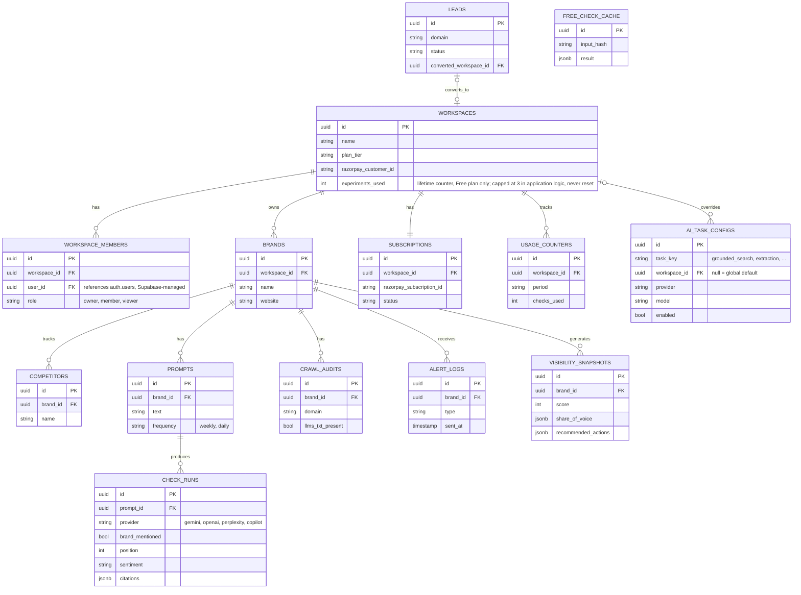

# Entity-Relationship Diagram

Postgres schema (Supabase) for the MVP. Scoped to exactly what modules 5.1-5.12 need — nothing added speculatively for Phase-2 engines (6.0) beyond the `provider` column already being a free-text field, which is what makes it extensible without a migration.

## Diagram

## Full column reference

Columns omitted from the diagram above for readability (every table also has `created_at timestamptz default now()` unless noted):

| Table                  | Additional columns                                                                                                                                                                                         |
| ---------------------- | ---------------------------------------------------------------------------------------------------------------------------------------------------------------------------------------------------------- |
| `workspaces`           | `created_at`                                                                                                                                                                                               |
| `workspace_members`    | `created_at`                                                                                                                                                                                               |
| `brands`               | `industry text`, `created_at`                                                                                                                                                                              |
| `competitors`          | `website text`                                                                                                                                                                                             |
| `prompts`              | `active bool default true`, `created_at`                                                                                                                                                                   |
| `check_runs`           | `model text`, `raw_answer text`, `reasoning text`, `competitor_names_found jsonb`, `cited_domains jsonb`, `cited_domain_types jsonb`, `status text` (success/error/rate_limited), `checked_at timestamptz` |
| `visibility_snapshots` | `mention_count int`, `avg_rank numeric`, `explanation_breakdown jsonb`, `opportunity_gaps jsonb`, `period_start date`, `period_end date`, `generated_at timestamptz`                                       |
| `crawl_audits`         | `robots_txt_result jsonb`, `schema_present bool`, `checked_at timestamptz`                                                                                                                                 |
| `alert_logs`           | `payload jsonb`                                                                                                                                                                                            |
| `subscriptions`        | `plan_tier text`, `current_period_end timestamptz`                                                                                                                                                         |
| `usage_counters`       | `prompts_used int`                                                                                                                                                                                         |
| `free_check_cache`     | `brand_name_input text`, `prompt_input text`, `created_at` (TTL enforced in application logic — see caching note below)                                                                                    |
| `leads`                | `company_name text`, `contact_email text`, `free_check_result jsonb`, `email_sent_at timestamptz`                                                                                                          |
| `ai_task_configs`      | `updated_by uuid FK → auth.users`, `updated_at timestamptz`, `created_at`                                                                                                                                  |

## Design decisions (read before modifying this schema)

**Why `check_runs` isn't split into a raw-answer table and a separate extracted-fields table.** They are always 1:1 (module 5.4 always processes exactly one 5.3 result) and always read together on the Prompt Explorer view. Splitting them would force a join on every read for no isolation benefit — the extraction fields are simply nullable until 5.4 finishes processing a row.

**Why `visibility_snapshots` holds both the score/share-of-voice data and the Explanation Engine output.** Same reasoning: one snapshot per brand per period, computed together, always displayed together on the Competitor Explorer view (module 5.6).

**Why `free_check_cache` and `leads` aren't linked to `brands`/`workspaces` by a required foreign key.** Both are populated by anonymous, pre-customer activity — there is no workspace yet when a visitor runs the free tool or when a lead is sourced by the growth pipeline. `leads.converted_workspace_id` is a nullable FK, set only if and when that lead becomes a paying customer, so the growth pipeline's effectiveness stays traceable without forcing every anonymous row into the tenant model.

**`ai_task_configs` is the one table with no customer-facing RLS at all.** Every other table's RLS grants access to the owning workspace's members; this one grants access to nobody except server-side Admin Console routes running under the Supabase service role. A `unique` index on `(task_key) WHERE workspace_id IS NULL` guarantees exactly one global default per task, and `unique (task_key, workspace_id) WHERE workspace_id IS NOT NULL` guarantees at most one override per task per workspace. See `docs/CONVENTIONS.md` Section 5 for the full resolution logic (workspace override → global default → `enabled` check) and why this lives in the DB instead of code.

**Row Level Security.** Every table below `brands` (competitors, prompts, crawl_audits, alert_logs, visibility_snapshots) is scoped by joining up to `brands.workspace_id`, matching `docs/CONVENTIONS.md` Section 5. `check_runs` is one join deeper (check_runs → prompts → brands → workspace), which is the one place worth denormalizing: add a `workspace_id` column directly onto `check_runs` (kept in sync via a trigger or set at insert time from the parent prompt), so its RLS policy is a single equality check instead of a two-level join on every one of the highest-volume table's reads. `free_check_cache` and `leads` have no RLS — they hold no tenant data.

**Caching.** `free_check_cache` implements the 24-hour public free-check cache from `docs/CONVENTIONS.md` Section 4 — enforced by checking `created_at > now() - interval '24 hours'` in application code before a cache hit is used, not by a database TTL feature (Supabase's free tier has none). A `unique index` on `input_hash` prevents duplicate concurrent writes for the same (brand, prompt) pair.

**Why `experiments_used` is a plain counter on `workspaces`, not a row in `usage_counters`.** `usage_counters` is inherently period-shaped (`period`, `checks_used`, `prompts_used`) — it exists to support billing-cycle resets for paid plans. The Free plan's 3-check allowance is a one-time lifetime cap with no period to reset against, so it lives as a single column on the workspace itself instead of forcing a periodic table to represent a non-periodic value. The cap (3) is enforced in application logic (5.3, 5.9), not a second DB column — it's a fixed product rule, not a per-workspace variable.

**What's deliberately not here.** No `notifications` table (5.8 sends email directly and logs to `alert_logs`, it doesn't need a queue at this scale). No per-engine tables for the Phase-2 providers (6.0) — `check_runs.provider` is already a free-text column, so adding OpenAI/Perplexity/Copilot is a data change, not a schema change. No soft-delete columns anywhere yet — add them when there's an actual customer-deletion flow to support, not before.
