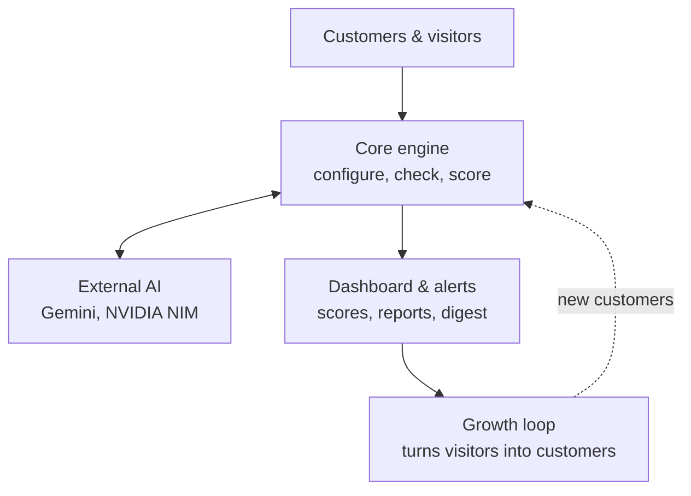
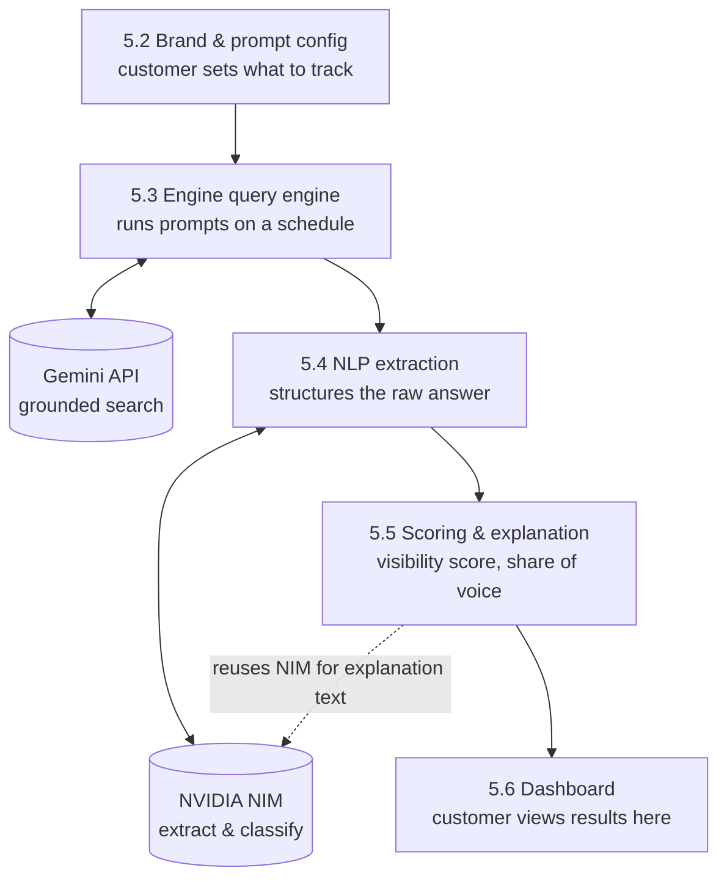
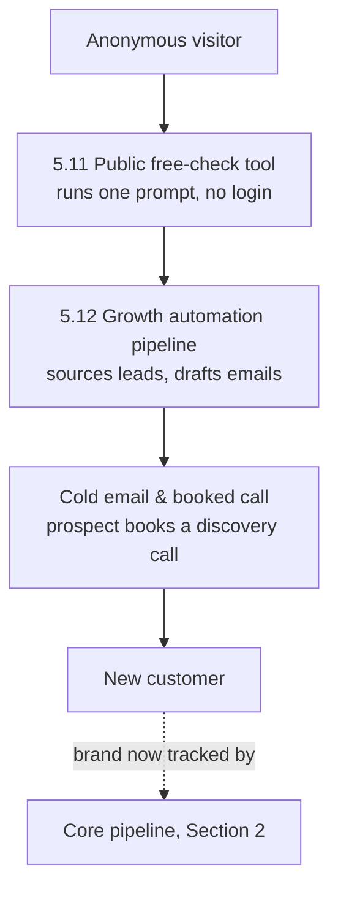

# System Architecture

Companion to `docs/spec/AEO_Visibility_Platform_Spec_v1.1.docx` Section 4-5 and `progress/modules/`. This file is the diagram source of truth — paste any block into a Mermaid live editor or a Markdown renderer that supports Mermaid to view it. Module IDs referenced below match `progress/progress.json`.

## 1. Overview

The system has four conceptual layers: people (customers and anonymous visitors), the core engine (modules 5.1-5.6), external AI providers, and a growth loop (5.11-5.12) that feeds new customers back into the core engine. Billing (5.9), the Admin Console (5.10), and the Crawl-Readiness Audit (5.7) are cross-cutting — they don't sit in the main request flow, so they're described in prose (Section 4) rather than drawn into every diagram.

## 2. Core check pipeline (modules 5.2-5.6)

The heart of the product. Every module here is built behind the `AIProvider` interface (5.3) so Gemini can be swapped for or joined by other engines later without a rewrite.

## 3. Growth loop (modules 5.11-5.12)

The product's own core function doubles as its lead-generation engine — an anonymous visitor's free check becomes the raw material for a personalized cold-outreach email.

## 4. Cross-cutting modules (not drawn into the main flow)

- **5.9 Billing & Subscription** — gates 5.2 (prompt-count limits) and 5.3 (check frequency) based on Razorpay subscription state. Reads/writes `subscriptions` and `usage_counters` (see the entity-relationship diagram).
- **5.10 Admin/Ops Console** — internal view combining platform health and business metrics: API quota consumption + error logs (5.3/5.4), revenue/plan mix (5.9's Razorpay subscription state), free-check usage and free-check→signup conversion (5.11), and visitor traffic/source (new `visitor_events` table). Mostly read-only over other modules' data; its one write path is the `visitor_events` beacon, a small endpoint hit by the marketing site and the free-check tool to log path/referrer/UTM — separate from and much lighter-weight than the core check pipeline. Access is gated by a `platform_admins` allowlist checked server-side on top of the same Supabase Auth session customers use, not a separate admin login (see 5.10's decisions log).
- **5.7 Crawl-Readiness Audit** — runs independently against the *customer's own site* (not an AI engine), on its own schedule, and writes into the same `crawl_audits` table the Dashboard (5.6) reads from. No dependency on 5.3-5.5.
- **5.8 Alerting & Reporting** — subscribes to new rows in `visibility_snapshots` (5.5's output) and sends the weekly digest; also watches for competitor-mention threshold changes.

## 5. Why this shape

The core pipeline (Section 2) is a straight line on purpose — every module has exactly one upstream and one downstream dependency, which is what makes the dependency graph in `progress/progress.json` a clean chain instead of a mesh. The growth loop (Section 3) is kept structurally identical to the core pipeline (it reuses 5.3 directly) rather than being a parallel implementation, so there is only one code path that ever talks to an AI provider.
